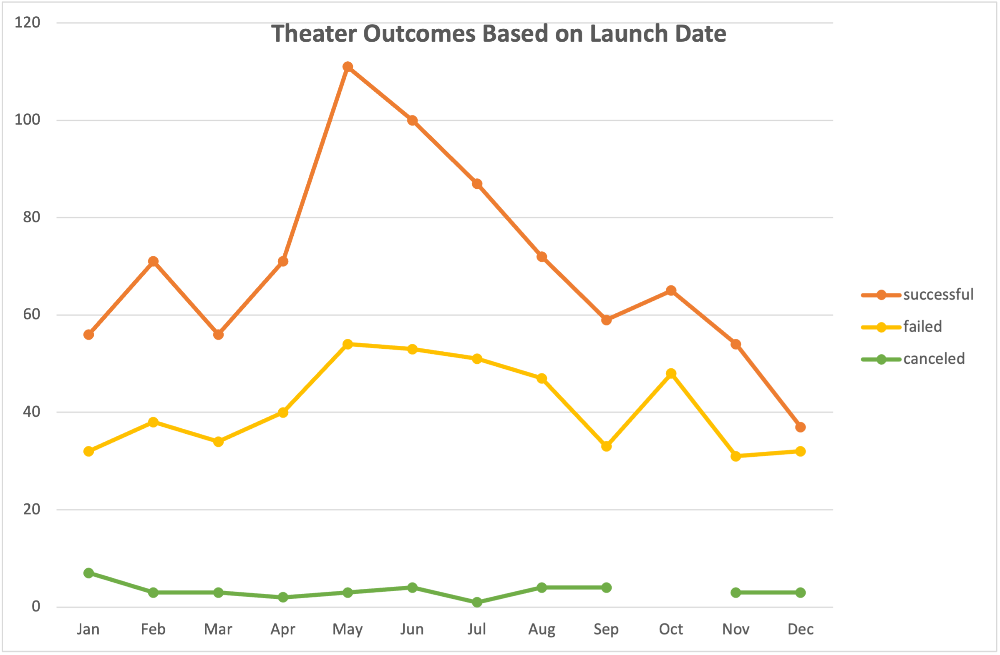
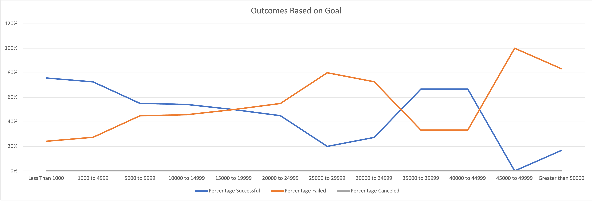

# Kickstarter Analysis

Performing analysis on Kickstarter data to uncover trends

## Overview of Project

### Purpose

The purpose of this activity was to take a set of data from the entertainment
industry on how many successes, fails, and canceled events based on the funding
of each project. After analyzing the data I was able to create charts based on
the customers needs.

## Analysis and Challenges

### Overview of the Analysis

By going over the data I noticed that there were not very many outliers on the data and everything was very closely financed for the size of the project.

### Challenges and Difficulties Encountered

One of the major challenges of this activity was the lack of tutorials about excel for Mac. Once I was able to learn how to navigate excel the activity went very smoothly.

## Results

- What are two conclusions you can draw about the Outcomes based on Launch Date?

  One conclusions that I can make from the outcomes based by launch date is that most successful theater productions are luanched from May to August. The other conclusion is that there is a slim chance that a theater production will be cancelled during the show's lifetime.

- What can you conclude about the Outcomes based on Goals?

- What are some limitations of this dataset?

- What are some other possible tables and/or graphs that we could create?

  - A chart to figure out what genres of shows are most successful in the theater area.

## Screenshots

##### Theater Outcomes vs Launch

##### Outcomes vs Goals

